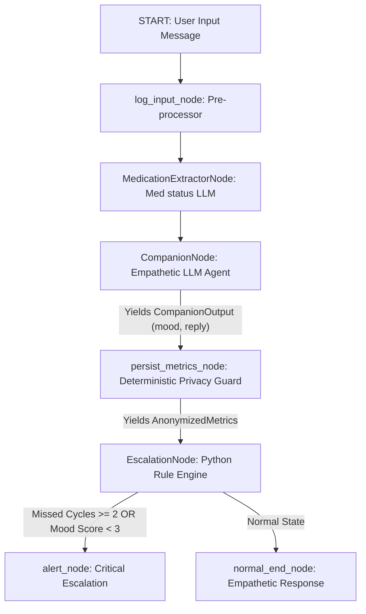

# AURA: Ambient Wellness Companion for Elderly Care (Agents for Good)

An ambient, privacy-first wellness companion designed for elderly care. This project utilizes the **Agent Development Kit (ADK 2.0)** framework to orchestrate a state-driven multi-agent system. It maintains an empathetic conversation loop with the user, fetches their medication schedules, anonymizes telemetry to strip out PII, and automatically escalates critical wellness drops or medication compliance failures.

**Live demo:** [agreddy.com/wellness/](https://agreddy.com/wellness/) · **Portfolio write-up:** [agreddy.com/projects/wellness-companion](https://agreddy.com/projects/wellness-companion) · **Source:** [github.com/agopalareddy/wellness-companion](https://github.com/agopalareddy/wellness-companion)

---

## 🌟 Core Architecture & Multi-Agent Flow

The companion is built as a state-driven graph containing three distinct, isolated agent/logic nodes. Below is the workflow diagram:



### Demo UI routes
*   **Patient view** (`/`): passcode-gated check-in dashboard with live JSON panel and agent activity sidebar
*   **Provider view** (`/provider/`): caregiver roster, live alerts, patient drill-down, JSON view, and patient CRUD
*   **About** (`/about/`): architecture overview for judges

When deployed under a URL subpath, nav links use relative paths and `/provider`/`/about` redirect to trailing-slash URLs so back-navigation works correctly.

Session controls: header buttons show **Unlock profile** / **Provider unlock** when logged out and **Log out** when a session is active.

### 1. Nodes & Execution Logic
*   **log_input_node**: Pre-processor that records the user message and injects the current medication schedule (with ids) into conversational history.
*   **MedicationExtractorNode**: A focused Gemini agent that maps patient wording to exact medication ids and outputs `medication_updates` + `medication_compliance`.
*   **CompanionNode (Empathetic Agent)**: Generates mood score and a warm natural-language reply. Medication status is handled by the extractor, not duplicated here.
*   **persist_metrics_node (Privacy Guard)**: A deterministic Python node that applies a server-side allowlist (`validate_metrics`) and writes mood/compliance/medication status to `mock_secure_db.json`. No LLM tool call is required, so the patient JSON panel always updates after a check-in.
*   **EscalationNode (State Evaluator)**: A Python rule engine that updates the compliance metrics (e.g. consecutive missed cycles) and performs conditional routing to trigger emergency alerts.

---

## 🔒 Security and Tool Isolation (Least Privilege)

To guarantee patient privacy, we enforce a strict **least-privilege security model** using filtered **Model Context Protocol (MCP)** toolsets:

1.  **Tool Separation**: The local MCP server (`app/mcp_server.py`) exposes `get_medication_schedule` and `log_wellness_metrics`.
2.  **Explicit Boundaries**:
    *   **MedicationExtractorNode** and **CompanionNode** have no database write tools. The schedule is injected in `log_input_node`.
    *   **persist_metrics_node** merges extractor output with companion mood and calls `apply_wellness_metrics` with an allowlist guard — only `mood_score`, `medication_compliance`, and `medication_updates` may be stored.
3.  **Strict Routing**: The companion agent cannot write to the secure mock database file. Telemetry persistence happens only in the deterministic privacy guard node after structured companion output is available.
4.  **Credentials**: Patient and provider passcodes are **not** stored in git. Configure them via environment variables (see `.env.example`). The demo passcode API is hidden unless `EXPOSE_DEMO_PASSCODES=true`.

### Medication status rules (`apply_wellness_metrics`)
*   **Explicit updates**: Only keys in `medication_updates` are changed when the companion provides per-med status.
*   **Full compliance fallback**: If `medication_compliance` is `true` and `medication_updates` is empty, all scheduled meds are marked `taken`.
*   **Partial/non-compliance**: If `medication_compliance` is `false` and updates are empty, existing med statuses are left unchanged (avoids incorrectly marking everything missed).

---

## 📊 State Schema (WellnessState)

The central state tracks patient history and compliance counters:

```python
class WellnessState(BaseModel):
    conversational_history: list[str] = Field(default_factory=list) # Full conversation history
    current_mood_score: int = 5                                     # Mood rating (1-10)
    medication_compliance_flag: bool = True                         # Compliance check
    consecutive_missed_cycles: int = 0                              # Multi-turn missed cycles tracker
    escalation_triggered: bool = False                              # Alert status flag
    companion_data: dict = Field(default_factory=dict)              # Companion LLM output storage
    anonymized_data: dict = Field(default_factory=dict)             # Anonymizer telemetry storage
```

### State Routing Rules:
*   **Medication Compliance**: If compliance is `True`, `consecutive_missed_cycles` resets to `0`. If `False`, it increments by `1`.
*   **Per-medication status**: `medication_updates` maps med IDs (e.g. `digestive_enzyme`, `vitamin_d`) to `taken`/`missed`/`pending`.
*   **Escalation**: If `consecutive_missed_cycles >= 2` OR `current_mood_score < 3` (critical threshold), the graph routes to `alert_node`, bypassing normal loops and setting `escalation_triggered` to `True`.

---

## 🏥 Provider API (demo)

| Endpoint | Auth | Purpose |
|----------|------|---------|
| `POST /api/provider/verify` | — | Validate provider passcode |
| `GET /api/provider/summary` | — | Patient roster with alert flags |
| `GET /api/provider/alerts` | — | Live alert inbox |
| `POST /api/patients` | `X-Provider-Passcode` | Create patient |
| `PUT /api/patient/{id}` | `X-Provider-Passcode` | Update patient |
| `DELETE /api/patient/{id}` | `X-Provider-Passcode` | Delete patient |
| `PATCH /api/patient/{id}/type` | `X-Provider-Passcode` | Toggle demo vs real patient |

Reset demo data via **Reset demo data** in the patient UI (`POST /api/reset` restores clinical data from `app/seed_db.json`).

---

## 🛠️ Quick Start & Setup

### Prerequisites
Make sure you have `uv` installed, then set up the google-agents-cli:
```bash
uv tool install google-agents-cli
agents-cli setup
```

### Installation
Sync project dependencies (installs `google-adk`, `mcp`, and linting utilities):
```bash
agents-cli install
cp .env.example .env   # then set passcodes locally
```

### Running the App
Run the interactive local playground to converse with the wellness companion:
```bash
agents-cli playground
```

Or serve the FastAPI demo UI:
```bash
uv run uvicorn app.fast_api_app:app --host 127.0.0.1 --port 8000
```

### Environment variables

| Variable | Purpose |
|----------|---------|
| `GOOGLE_API_KEY` | (Optional) Deployer-level Google AI Studio API key. When set, all LLM calls use AI Studio instead of Vertex AI. Users in the UI can also supply their own key, which takes precedence over this one. Get a key at [aistudio.google.com/apikey](https://aistudio.google.com/apikey). |
| `PROVIDER_PASSCODE` | Provider dashboard auth (required for CRUD) |
| `PASSCODE_ARTHUR` / `PASSCODE_BEATRICE` / `PASSCODE_CHARLES` | Patient profile unlock codes |
| `EXPOSE_DEMO_PASSCODES` | Set `true` locally to show passcodes in the UI helper |

### User-provided API key & rate limiting

When a user does **not** supply their own AI Studio API key, the companion enforces a **4 calls/day/device** rate limit to protect the deployer's quota. The remaining call count is shown prominently in a bar between the header and dashboard.

Users can paste their own [Google AI Studio API key](https://aistudio.google.com/apikey) via the UI input at the top of the dashboard. Set a [spending limit](https://aistudio.google.com/spend) on your key to control costs. When a user key is active:
- No rate limits apply (the user's own quota is used)
- The key is stored **only in the browser's localStorage** — never on the server
- The key is sent exclusively as an `X-Google-API-Key` header for model calls
- The bar turns green and shows "🔑 Using your API key"

### Running Tests and Linting
To check code quality and execute unit tests (which validate the escalation logic in isolation):
```bash
# Run styling checks
agents-cli lint

# Execute isolated state transition unit tests
uv run pytest tests/unit
```

---

## 🌐 Deployment

The patient dashboard static UI is served from the [personal-website](https://github.com/agopalareddy/personal-website) repo at `/wellness/`. The FastAPI agent backend runs as a separate process (port `8090` on the GCP showcase VM) and is reverse-proxied for ADK routes and `/api/patient/` endpoints.

| Surface | URL |
|---------|-----|
| Patient dashboard | `https://agreddy.com/wellness/` |
| ADK dev-ui playground | `https://agreddy.com/wellness/dev-ui/` |
| Project page | `https://agreddy.com/projects/wellness-companion` |

Passcodes and provider credentials are configured via `.env` on the server — never commit them. Set `EXPOSE_DEMO_PASSCODES=true` locally to surface passcodes in the UI helper during development.
