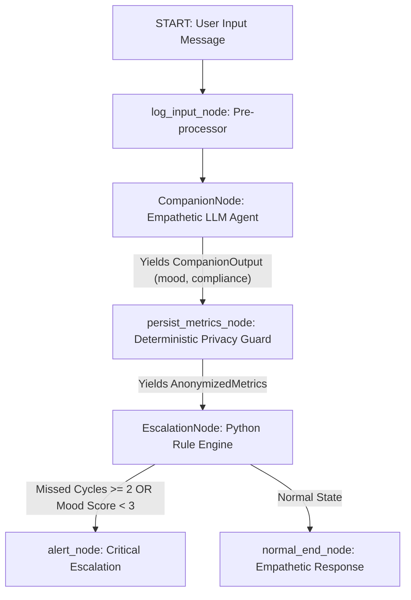

# Ambient Wellness Companion for Elderly Care (Agents for Good)

An ambient, privacy-first wellness companion designed for elderly care. This project utilizes the **Agent Development Kit (ADK 2.0)** framework to orchestrate a state-driven multi-agent system. It maintains an empathetic conversation loop with the user, fetches their medication schedules, anonymizes telemetry to strip out PII, and automatically escalates critical wellness drops or medication compliance failures.

---

## 🌟 Core Architecture & Multi-Agent Flow

The companion is built as a state-driven graph containing three distinct, isolated agent/logic nodes. Below is the workflow diagram:



### Demo UI routes
*   **Patient view** (`/`): passcode-gated check-in dashboard with live JSON panel and agent activity sidebar
*   **Provider view** (`/provider/`): caregiver roster, live alerts, patient drill-down, JSON view, and patient CRUD (provider passcode via `PROVIDER_PASSCODE` env)
*   **About** (`/about/`): architecture overview for judges

When deployed under a subpath (e.g. `example.com/wellness/`), nav links use relative paths and `/provider`/`/about` redirect to trailing-slash URLs so back-navigation works correctly.

Session controls: header buttons show **Unlock profile** / **Provider unlock** when logged out and **Log out** when a session is active.

### 1. Nodes & Execution Logic
*   **log_input_node**: A pre-processing Python node that intercepts incoming messages, formats them, and records the raw user prompt into the session's conversational history state.
*   **CompanionNode (Empathetic Agent)**: A Gemini 3.5 Flash agent that conducts natural language check-ins, checks on the patient's mood and wellness, and pulls daily medication routines.
*   **persist_metrics_node (Privacy Guard)**: A deterministic Python node that applies a server-side allowlist (`validate_metrics`) and writes mood/compliance/medication status to `mock_secure_db.json`. No LLM tool call is required, so the patient JSON panel always updates after a check-in. Per-medication updates are applied only when explicitly present in `medication_updates` — unmentioned meds keep their current status.
*   **EscalationNode (State Evaluator)**: A Python rule engine that updates the compliance metrics (e.g. consecutive missed cycles) and performs conditional routing to trigger emergency alerts.

---

## 🔒 Security and Tool Isolation (Least Privilege)

To guarantee patient privacy, we enforce a strict **least-privilege security model** using filtered **Model Context Protocol (MCP)** toolsets:

1.  **Tool Separation**: The local MCP server (`app/mcp_server.py`) exposes `get_medication_schedule` and `log_wellness_metrics`.
2.  **Explicit Boundaries**:
    *   **CompanionNode** is provided only with `companion_toolset` (which filters and exposes *only* the `get_medication_schedule` tool). It has **no access** to the database tool.
    *   **persist_metrics_node** calls `apply_wellness_metrics` directly with an allowlist guard — only `mood_score`, `medication_compliance`, and `medication_updates` may be stored.
3.  **Strict Routing**: The companion agent cannot write to the secure mock database file. Telemetry persistence happens only in the deterministic privacy guard node after structured companion output is available.

---

## 📊 State Schema (WellnessState)

The central state tracks patient history and compliance counters:

```python
class WellnessState(BaseModel):
    conversational_history: list[str] = Field(default_factory=list) # Full conversation history
    current_mood_score: int = 5                                     # Mood rating (1-10)
    medication_compliance_flag: bool = True                         # Compliance check
    consecutive_missed_cycles: int = 0                              # Multi-turn missed cycles tracker
    escalation_triggered: bool = False                              # Alert status flag
    companion_data: dict = Field(default_factory=dict)              # Companion LLM output storage
    anonymized_data: dict = Field(default_factory=dict)             # Anonymizer telemetry storage
```

### State Routing Rules:
*   **Medication Compliance**: If compliance is `True`, `consecutive_missed_cycles` resets to `0`. If `False`, it increments by `1`.
*   **Per-medication status**: `medication_updates` maps med IDs (e.g. `digestive_enzyme`, `vitamin_d`) to `taken`/`missed`/`pending`. Empty updates do not blanket-mark all meds.
*   **Escalation**: If `consecutive_missed_cycles >= 2` OR `current_mood_score < 3` (critical threshold), the graph routes to `alert_node`, bypassing normal loops and setting `escalation_triggered` to `True`.

---

## 🏥 Provider API (demo)

| Endpoint | Auth | Purpose |
|----------|------|---------|
| `POST /api/provider/verify` | — | Validate provider passcode |
| `GET /api/provider/summary` | — | Patient roster with alert flags |
| `GET /api/provider/alerts` | — | Live alert inbox |
| `POST /api/patients` | `X-Provider-Passcode` | Create patient |
| `PUT /api/patient/{id}` | `X-Provider-Passcode` | Update patient |
| `DELETE /api/patient/{id}` | `X-Provider-Passcode` | Delete patient |
| `PATCH /api/patient/{id}/type` | `X-Provider-Passcode` | Toggle demo vs real patient |

Patient passcodes: configure via `PASSCODE_*` env vars. Reset demo data via **Reset demo data** in the patient UI (`POST /api/reset` restores from `app/seed_db.json`).

---

## 🚀 Production deployment (GCP showcase)

Live demo: [example.com/wellness/](https://example.com/wellness/)

```bash
# Sync app code to server
rsync app/ to your deployment host

# Restart
restart your app process manager
```

Nginx proxies `/wellness/` → `127.0.0.1:8090/`. PM2 cwd: `/path/to/wellness-companion`.

---

## 🛠️ Quick Start & Setup

### Prerequisites
Make sure you have `uv` installed, then set up the google-agents-cli:
```bash
uv tool install google-agents-cli
agents-cli setup
```

### Installation
Sync project dependencies (installs `google-adk`, `mcp`, and linting utilities):
```bash
agents-cli install
```

### Running the App
Run the interactive local playground to converse with the wellness companion:
```bash
agents-cli playground
```

### Running Tests and Linting
To check code quality and execute unit tests (which validate the escalation logic in isolation):
```bash
# Run styling checks
agents-cli lint

# Execute isolated state transition unit tests
uv run pytest tests/unit
```
